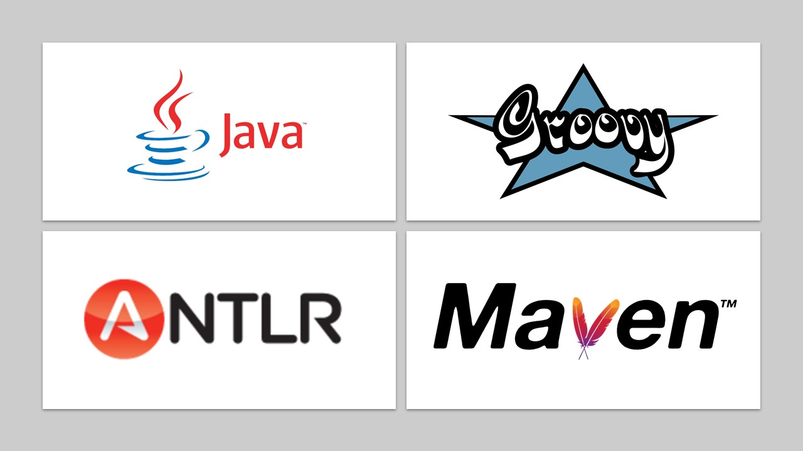

##   Dsl-groupe-B

* Auteurs: **Team B**
    * AINADOU Florian
    * DJEKINOU Paul-Marie
    * KOFFI Paul
    * NABAGOU Djotiham
* Version actuelle : Basic scenarios + Signaling stuff by using sound + Temporal transitions
* Livrables :
    * [delivery-first](https://github.com/pns-si5-soa/box-20-21-team-f/releases/tag/delivery-first) : Première livraison

##   Démos rapide de nos fonctionnalités
* `Very Simple Alarm` : [ici](https://drive.google.com/file/d/19RyqV8oVMZ8SNIQ71oXbLt3mdt5Y3ou1/view?usp=sharing)
* `Dual-check alarm` :  [ici](https://drive.google.com/file/d/1m-97sSkBXMuvHhR0sY43K60d9z-EbGZW/view?usp=sharing)
* `State-based alarm`  : [ici](https://drive.google.com/file/d/1XQG8X36FR4e23ONn1-RCl5AVm3z95tvY/view?usp=sharing)
* `Multi-state alarm` : [ici](https://drive.google.com/file/d/1Gk-Z64GswuqCTPo54cjSjKeaVHRz1ffB/view?usp=sharing)
* `Signaling stuff by using sounds` : [ici](https://drive.google.com/file/d/1lv3JnBRAOmwbYhtBqW3b_fPNmovczSaQ/view?usp=sharing)
* `Temporal transitions` : [ici](https://drive.google.com/file/d/1I46yfE0j3oK-w-emfjAi7bt3pc_IjSZB/view?usp=sharing)


##   Comment utiliser ce repository

* La branche `main` (la branche par défaut) représente la dernière version stable du système.
* La branche `external` représente le système en cours de développement spécifique au DSL externe en Antlr.
* La branche `feature/internalDSLab` représente le système en cours de développement spécifique au DSL interne en groovy.

##   Récupération du projet

  Effectuer un clone classique du projet en faisant ```git clone https://github.com/wak-nda/dsl-groupe-b.git``` ou en récupérant le zip depuis cette page.

##   Compilation
1 - Effectuez à la racine du projet `mvn clean install`  
2 -`cd dsl-antlr` puis ensuite `mvn clean compile assembly:single` pour la génération avec Antlr  
3 - `cd dsl-groovy` puis ensuite `mvn clean compile assembly:single` pour la génération avec Groovy  

##  Générer le code Arduino à partir du DSL
1 - Pour générer avec Groovy (exemple de VerySimpleAlarm.groovy):   
* `runInternal.sh VerySimpleAlarm.groovy VerySimpleAlarm` , le fichier généré se trouvera dans le dossier `scripts/ouputs`

2 - Pour générer avec Antlr (exemple de VerySimpleAlarm.groovy):
* `runExternal.sh VerySimpleAlarm.groovy VerySimpleAlarm` , le fichier généré se trouvera dans le dossier `scripts/ouputsExternal` 

3 - Dans le cas d'un nouveau script groovy, placez le fichier dans le dossier `scripts`, puis suivez les deux précédentes étapes selon votre choix. Un fichier `.ino` sera généré dans le dossier approprié.


##  Utiliser le DSL

### Syntaxe
La syntaxe du DSL est la suivante : 

##   Pile Technologique
  <p align="center">
    
  </p>